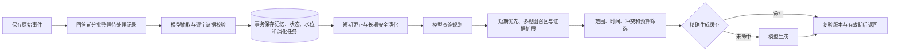

# 长短期记忆系统架构

本系统采用模块化单体后端。SQLite 保存权威事件、事实与审计，检索索引和摘要均为可重建投影。HTTP 展示前端与可选 Engine 适配器调用同一个 `MemoryRuntime`；本轮不包含真实课程宿主集成验收。

## 模块边界

| 层 | 模块 | 职责 |
|---|---|---|
| 展示 | 相邻 `memory-ui/` | React/TypeScript 展示对话、真实运行阶段、检索证据、生命周期及加速观测 |
| 协议 | `api.py`、`integrations/rag_sdk.py` | HTTP/NDJSON、可信身份范围、参数校验和错误映射 |
| 应用 | `runtime.py`、`short_term.py`、`long_term.py` | 自动抽取、状态更新、演化重试、维护与回答编排 |
| 检索 | `retrieval.py`、`retrieval_projection.py` | 意图规划、混合候选、证据关系扩展、预算选择及索引投影 |
| 领域 | `models.py`、`ports.py`、`evidence_policy.py`、`maintenance.py` | 数据契约、证据规则、关系与保留策略 |
| 基础设施 | `store.py`、`providers.py`、`embeddings.py`、`acceleration.py` | SQLite、模型服务、向量服务及生成缓存 |

核心包不导入 FastAPI 或课程 SDK。SimpleMem、Zep、H-MEM 是方法参考，不是被直接调用的运行时组件。

## 在线闭环

`answer` 默认先处理积压，每批最多 5 个新 turn，最多补充 15 个已处理 turn 作为语境；turn 是持久化记录单位，不保证等于完整的用户—助手对话轮。`search` 保持只读，不自动调用抽取。手动 `/extract` 仍可独立运行。

原文、抽取结果、摘要和处理水位在同一事务中提交，演化任务同时写入 SQLite outbox。抽取模型、Schema 或证据校验失败时水位不推进；抽取提交后演化失败返回可见警告，任务保留，后续调用可重试，重启后仍可恢复。回答规划或生成失败不会撤销已经成功提交的抽取。

## 证据与记忆演化

- 每个候选必须引用本批至少一个新 turn，并提供准确事件位置和逐字引文。
- 问句属于对话语境，不能建立肯定事实；截掉问号或混入助手回答不能绕过原事件检查。助手输出本身不能证明用户事实。
- 用户证据支持的持久、用户/项目范围陈述可以自动晋升；临时约束仍保留在会话范围。
- 相同结构化事实允许措辞不同，但合并必须保持主体、属性、值、断言、作用域和有效期一致，并保留证据。
- 明确现实变化使用 `supersede`，关闭旧有效期并建立新版本；明确原说法错误使用 `correct`，撤回错误版本。依据不充分的异值候选进入 `pending`。
- 模型关系判断提供带引文的审核建议，不能越过确定性规则直接改写事实。
- `version` 标识事实版本；`revision` 随状态等修改递增。更新同时提供 `expected_version`、`expected_revision`，目标操作还应提供目标对应字段，以防旧页面和状态往返后的过期操作。

## 检索与索引

检索保留 SimpleMem 的意图规划、STM 优先和动态 K 主线。规划结果包含路由、语义查询、关键词、主体/属性、所需信息和时间条件。只有明确而唯一的单字段查询已被短期证据满足时，才跳过长期补充。

方案类请求在同一个 `QueryPlan` 中增加结构化输出契约：`response_intent` 标识是否需要生成行动方案，`problem_breakdown` 承载问题拆分，`required_info` 与 `information_gathering` 指向需要梳理的证据槽位，`integration_steps` 指明整合顺序，`action_template` 和 `action_elements` 固化通用行动计划、方案与任务指令卡、应急行动计划三类模板。方案与任务指令卡进一步固定 Markdown 骨架：方案名称、作战概述、兵力部署、兵力编成与位置表格、情景假设与分案、部署阵型、总体概述和任务指令卡字段。生成侧必须先显式输出“需求拆分、所需信息梳理、信息整合”，再按模板生成方案。填充策略分三层：检索事实直接入方案；地形、方向、阶段和协同方式等可推演变量用显式情景假设和多分案补足；兵力、装备、坐标等不能推出的关键事实标为“需确认”并追问。系统不得虚构兵力、装备、真实坐标、现实身份目标或未给出的敌情。

词法路线使用中文/英文预分词的 SQLite FTS5 候选投影，再计算有界 BM25 分数；符号路线按主体、属性和作用域等精确约束；配置 Embedding 后增加真实余弦召回。显式实体事实可进行最多两跳证据扩展，支持路径必须附带来源，不能猜测实体身份。层级标签提供附加召回信号，不强制逐层搜索。重复结果按记忆身份与版本归并，保留命中通道；分数不是事实置信度。

每个记忆层内按现有计划选择通道：明确单字段且有匹配记录时执行词法与符号；开放、多信息项和时间问题启用已配置的语义通道，符号通道需完整主体/属性。规则不调用额外模型。语义启用时最多三个任务并发，纯本地路径仅使用一次线程池调度。各通道返回独立结果，统一按固定通道顺序、记忆ID与版本合并；共同受原查询期限约束，一路失败取消其余异步任务并保留原错误类型。短期优先、长期预算、命名空间锁和删除代次检查继续生效。[条件检索说明](docs/CONDITIONAL_RETRIEVAL.md)记录策略与性能边界。

投影按可信主体及会话命名空间隔离，内容变化增量同步；向量按模型身份和内容摘要复用。删除使用投影代次防止在途任务重新发布已清理的数据。当前仍先读取授权 owner 的权威快照，再执行投影候选检索和最终约束；没有完成 ANN、数据库级端到端候选下推或分布式向量检索。未配置 Embedding 时明确标为 `lexical_baseline`。

## 长期维护

各层 Domain / Category / Trace 建立提取式来源摘要；可选模型在有限组数、输入数量和时间预算内生成高层概括。摘要标注使用的实际版本和覆盖数量，只作为导航，不能成为新的 Memory 或抽取证据。事实更新、撤回和自然到期会使相关摘要不可继续作为有效视图返回。

维护按年龄与独立证据事件计算保留强度。过期事件可自动归档，衰减较强的稳定事实只产生审核建议；归档可恢复，不销毁历史和证据，恢复也不延长事实有效期。`activate` 用于明确恢复待决候选，`restore` 用于恢复归档项，二者均有状态与版本检查。

独立 HTTP 服务启动周期维护 worker；`MEMORY_MAINTENANCE_INTERVAL` 默认 300 秒，设为 0 禁用。worker 仅处理本服务配置的本地 principal，不是跨租户调度平台，也不会替课程宿主自动启动维护任务。手动 `/maintenance` 保留为可观察的维护入口。

## 运行展示和推理复用

`POST /api/v1/sessions/{id}/answer/stream` 返回 NDJSON：运行阶段、最终回答或错误来自实际任务事件。阶段包含抽取、规划、检索、生成等真实边界；它不输出模型隐藏思维链，也不是逐 token 生成流。

生成缓存以完整提示、来源身份与版本、数据库状态、会话、模型实例及主体为键，采用 TTL/LRU，并合并相同在途请求。每次仍进行授权和新鲜检索；状态修改和有效期跨界会阻止旧结果返回。这属于减少重复生成调用的系统级优化，不是 GPU/KV Cache 或投机解码。

## 交付边界

当前面向单节点。多用户身份体系、跨进程缓存失效、多副本运维和生产容量仍需独立验收。token 预算仍采用保守字符估计。来源 ID 正确不代表摘要或回答已通过逐句忠实度验证；开发用例不能代替 LoCoMo、LongMemEval 等公开基准。测试与运行证据统一见 [VERIFICATION.md](docs/VERIFICATION.md)。
