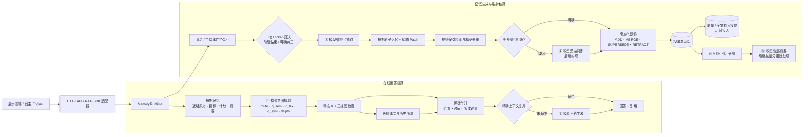

# 实现框架与模型调用边界

本项目以独立后端为主体。配套 `memory-ui` 前端只访问 HTTP API；宿主 Engine 通过可选 RAG SDK 适配器访问同一个 `MemoryRuntime`。SimpleMem、Zep 和 H-MEM 是局部方法依据，不是运行时依赖。`full-forward` 的测试与部署状态见 [交付说明](../DELIVERY.md)。

## 实现框架



图中 ①②③ 已有调用接口；④⑤只保留扩展位置，当前代码不会调用。H-MEM 只组织长期记忆，不替代 ① 的 SimpleMem 意图规划和动态 K。

## 哪些步骤调用模型

| 编号 | 调用时机 | 输入 | 结构化输出 | 当前状态 | 单次操作调用数 |
|---:|---|---|---|---|---:|
| ① | 每次配置模型后的 search/answer | Query + 当前任务摘要 + 最多 8 条短期记忆 | `QueryPlan` | 已实现 | 1；Schema 错误最多再修复 1 次 |
| ② | `/answer` 完成检索后 | Query + 短期状态 + 有效检索证据 | 普通回答 + `【来源N】` | 已实现 | 1，不做格式修复 |
| ③ | 5 个待处理 turn、token 压力或显式触发 | 最多 5 个新 turn + 最多 15 个旧 turn 语境 | `ExtractionResult` | 已实现 | 1；Schema 错误最多再修复 1 次 |
| ④ | 精确规则无法判断新旧记忆关系 | 新候选 + 同 owner/scope/subject/predicate 的少量旧事实 | `RelationProposal` | 后续实现 | 每个歧义小批次 1 次 |
| ⑤ | H-MEM 分组变脏且达到批处理条件 | 一个分组内的有效事实摘要和 ID | 带来源的上层摘要 | 后续实现 | 每个脏分组 1 次，不在每次查询调用 |

以下步骤不调用聊天大模型：消息持久化、幂等检查、权限和作用域过滤、动态 K 数值计算、精确重复判断、有效时间过滤、版本更新、审计历史、SDK 字段封装。Embedding 是独立的向量模型接口，不应把聊天模型的回答接口当成向量接口。

一次 `/search` 在配置模型后通常调用 ① 一次。一次 `/answer` 通常调用 ① + ②，共两次。一次 `/extract` 通常调用 ③ 一次。只有结构化 JSON 不合法时，① 或③才允许一次格式修复；网络错误直接向上抛出，不重复请求。

## DeepSeek 接入

后端沿用 `MEMORY_MODEL_*` 配置，不增加第二套密钥变量。将 `MEMORY_MODEL_BASE_URL` 设为 `https://api.deepseek.com`，`MEMORY_MODEL_NAME` 设为 `deepseek-flash`，并在私有 `.env` 中填写 DeepSeek API Key。规划、抽取、回答仍使用同一个 `MemoryRuntime`；DeepSeek 请求关闭默认思考模式，规划和抽取启用 JSON Output。前端只调用本地后端，`/health` 显示 `model_provider=deepseek`。

## GLM 接入

现有 `OpenAICompatibleModel` 会向 `{base_url}/chat/completions` 发请求，使用 Bearer API key。若智谱账户使用官方兼容接口，可配置：

```powershell
cd "C:\Users\zhangjinhan\Desktop\Agent Mem\memory-system"
.\.venv\Scripts\Activate.ps1
$env:MEMORY_MODEL_BASE_URL="https://open.bigmodel.cn/api/paas/v4"
$env:MEMORY_MODEL_NAME="<你的账户已开通的 GLM 模型名>"
$env:MEMORY_MODEL_API_KEY="<只保存在本机环境变量中的 API Key>"
$env:MEMORY_MODEL_TIMEOUT="90"
$env:MEMORY_MODEL_MAX_TOKENS="4096"
python -m agent_memory
```

不要把 Key 放进前端、Git、Markdown、请求日志或提交记录。前端只调用本后端；模型请求始终由后端发送。

先用一个模型完成 ①②③，减少配置和调试成本。实际数据表明回答质量和抽取成本存在明显差异时，再把 `MemoryModel` 拆为 `planner_model / extraction_model / answer_model`；同一个 API key 可以由不同角色适配器复用，但每个角色应独立记录模型名、耗时和 token。

## 接入后验证顺序

1. 用 `/health` 确认 `model_configured=true`。
2. 创建会话并写入 5 个带稳定 `request_id` 的 turn。
3. 调用 `/extract`，检查候选都引用真实 turn 和逐字 quote。
4. 调用 `/search`，检查 `plan.route/depth`、`selected_k <= top_k` 和 `mode`。
5. 调用 `/answer`，检查 `【来源N】` 只引用实际 sources。
6. 使用错误 JSON 的模拟响应验证只修复一次；使用 503/timeout 验证错误传播且抽取水位不前进。
7. 在开发集上测量抽取 F1、证据 F1、Recall@K、查询 token 和端到端成本，再决定是否实现 ④⑤。
